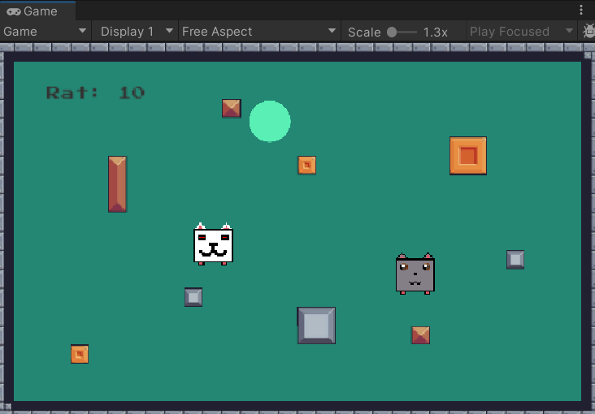

# Cat Aim Bot
> [Description](#description) | [Install](#install) | [Screenshot Demo](#screenshot) | [Main Features include](#main-features-include) | [Tutorial](#tutorial)
## Description:
- A game made by Unity engine (C#)
- Just for personal project in DeverGame
## Plot:
> [_Video-Demo_](https://youtu.be/RMzKPTu2Nwo)
## Install:
```bash
git clone https://github.com/Meoleodeo/CatAimBot
cd CatAimBot
echo thanks
```
## Screenshot:

## Main Features include:
- Count point (Rat sellect circleObject)
- END GAME (Cat touch Rat)
## Tutorial:
+ Player 1: **Cat**
- Press W_Key: move up
- Press S_Key: move down
- Press A_Key: move left
- Press D_Key: move right
+ Player 2: **Rat**
- Arrow keys to move in directions